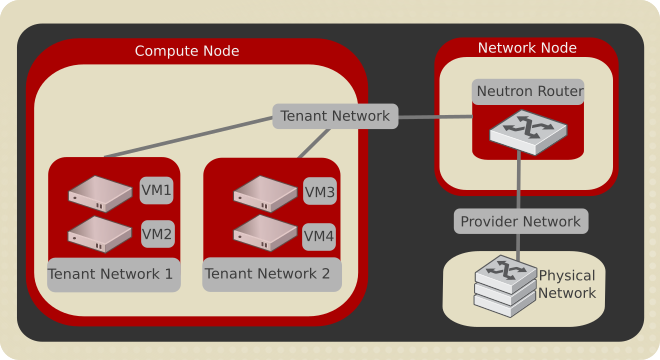

# OpenStack Neutron

OpenStack是构建私有云的事实上的标准平台，它由多个子系统构成：计算（Nova）、存储（Swift等）、网络（Neutron）。NFV的关键点在于网络，所以我们重点介绍Neutron。

## 目的

## 架构

## 概念

### Provider network

Provider networks offer layer-2 connectivity to instances with optional support for DHCP and metadata services. These networks connect, or map, to existing layer-2 networks in the data center, typically using VLAN (802.1q) tagging to identify and separate them.

Provider networks generally offer simplicity, performance, and reliability at the cost of flexibility. By default only administrators can create or update provider networks because they require configuration of physical network infrastructure. 

Also, provider networks only handle layer-2 connectivity for instances, thus lacking support for features such as routers and floating IP addresses.

In many cases, operators who are already familiar with virtual networking architectures that rely on physical network infrastructure for layer-2, layer-3, or other services can seamlessly deploy the OpenStack Networking service. In particular, provider networks appeal to operators looking to migrate from the Compute networking service (nova-network) to the OpenStack Networking service. Over time, operators can build on this minimal architecture to enable more cloud networking features.

In general, the OpenStack Networking software components that handle layer-3 operations impact performance and reliability the most. To improve performance and reliability, provider networks move layer-3 operations to the physical network infrastructure.

In one particular use case, the OpenStack deployment resides in a mixed environment with conventional virtualization and bare-metal hosts that use a sizable physical network infrastructure. Applications that run inside the OpenStack deployment might require direct layer-2 access, typically using VLANs, to applications outside of the deployment.

## Routed Provider Network

Routed provider networks offer layer-3 connectivity to instances. These networks map to existing layer-3 networks in the data center. More specifically, the network maps to multiple layer-2 segments, each of which is essentially a provider network. Each has a router gateway attached to it which routes traffic between them and externally. The Networking service does not provide the routing.

Routed provider networks offer performance at scale that is difficult to achieve with a plain provider network at the expense of guaranteed layer-2 connectivity.

## Self-service Network

Self-service networks primarily enable general (non-privileged) projects to manage networks without involving administrators. These networks are entirely virtual and require virtual routers to interact with provider and external networks such as the Internet. Self-service networks also usually provide DHCP and metadata services to instances.

In most cases, self-service networks use overlay protocols such as VXLAN or GRE because they can support many more networks than layer-2 segmentation using VLAN tagging (802.1q). Furthermore, VLANs typically require additional configuration of physical network infrastructure.

Here is an example of how a tenant network is connected with provider network.

## 参考

[Network slice and Openstack](https://serverascode.com/2018/06/14/5g-network-slicing.html)