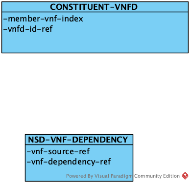

# NSD(Network Service Descriptor)

`NSD`描述了网络能力，它包括了多个方面的属性：`constituent-vnfd`、`topology`、`placement`、`configuration`和`scale`。


## constituent-vnfd

`NS`由多个`VNF`构成，NSD定义了网络服务描述符和组成该网络的VNF的描述符之间的关系。



其中，`NSD-VNF-DEPENDENCY`定义了vnf之间的依赖关系，它们决定了在创建网络服务实例时vnf的创建顺序。

## topology

`topolocy`描述了网络能力的拓扑属性。


### NSD-VLD(Virtual link descriptor)

描述网络内部VNF之间的虚拟链接（VIRTUAL LINK），

### VNFD::CONNECTION-POINT

描述VNF对外的连接点，用于连接其它VNF或者VL。

### CONNECTION-POINT

描述网络层面的对外连接点，用于连接其它网络。对外连接点的一侧连接到外部网络，另一侧则连接到内部的VNF或者VL。

### VNFFGD(VNF forwarding graph descriptor)

描述网络内部的数据转发关系。
每个转发关系是一张图，图由多个转发路径RSP（render service path）构成，而每个RSP则包含多个VNF以及VNF内部的转发规则。
这里有个简单的例子：

```
 +------------------------------------------------------+
 |                     Network Service                  |
 |                                                      |
 |                                                      |
 |                                                      |
 |         +-----------+             +-----------+      |
+++        |           |             |           |     +++
|C1--------P1  VNF1    |             |    VNF2   P4----+C2
+++        |           |             |           |     +++
 |         |           |             |           |      |
 |         +-----P2----+             +------P3---+      |
 |               |                          |           |
 |               |   +---------------+      |           |
 |               |   |               |      |           |
 |               +--->      VLD1     +------+           |
 |                   +---------------+                  |
 +------------------------------------------------------+

```

在上面的图中，VNFFG只包含了一条路径：
> C1 -> VNF1(P1, P2) -> VNF2(P3, P4) -> C2

其中，C1和C2是网络服务的连接点，VNF1(P1, P2)和VNF2(P3, P4)分别是两个VNF内部的转发规则；P1-P4是VNF的连接点，一般对应到虚拟机的网卡/端口。

VNF内部转发规则包含以下属性：
| attribute | desc |
| ---- | ---- |
| member-vnf-index-ref | 负责转发的vnf |
| order | vnf在转发路径上的顺序|
| vnfd-id-ref |负责转发的vnf|
| vnfd-ingress-connection-point-ref |转发vnf的数据流入连接点|
| vnfd-egress-connection-point-ref |转发vnf的数据流出连接点|

转发关系还包含了`classifer`，用于说明转发路径的数据匹配规则，比如：源IP地址，目标IP地址等，只有符合条件的数据包才会被转发到该路径上。

这里有篇[很好的文章]((https://www.telcocloudbridge.com/blog/beginners-guide-to-network-service-and-vnf-forwarding-graph-in-nfv/))，可以帮助我们理解NFV中的转发图和路径概念。

Openstack支持VNFFG的创建，可以参考[相关文章](https://specs.openstack.org/openstack/tacker-specs/specs/newton/tacker-vnffg.html)了解细节。简单来说，
VNFFG被映射成Openstack中的[SFC](https://docs.openstack.org/networking-sfc/ocata/))

> Service Function Chaining is a mechanism for overriding the basic destination based forwarding that is typical of IP networks. It is conceptually related to Policy Based Routing in physical networks but it is typically thought of as a Software Defined Networking technology. It is often used in conjunction with security functions although it may be used for a broader range of features. Fundamentally SFC is the ability to cause network packet flows to route through a network via a path other than the one that would be chosen by routing table lookups on the packet’s destination IP address. It is most commonly used in conjunction with Network Function Virtualization when recreating in a virtual environment a series of network functions that would have traditionally been implemented as a collection of physical network devices connected in series by cables.
> 
> A very simple example of a service chain would be one that forces all traffic from point A to point B to go through a firewall even though the firewall is not literally between point A and B from a routing table perspective.
> 
> A more complex example is an ordered series of functions, each implemented in multiple VMs, such that traffic must flow through one VM at each hop in the chain but the network uses a hashing algorithm to distribute different flows across multiple VMs at each hop.

另外，了解[Openstack对网络的支持](https://docs.openstack.org/newton/networking-guide/intro.html)对我们理解网络服务的编排很有帮助。

## placement

网络服务中包含多个VNF，部署时有些VNF需要被放置到一个数据中心，有些VNF则需要分开部署。`placement`就是定义这些策略。

## configuration

`configuration`定义了如何配置网络服务。


NSD的配置由VCA-CONFiGURATION和VCA-RELATION两部门构成。
> `VCA`(VNF configuration and abstraction)是OSM特有的概念，在MANO规范中并不存在，OSM之所以引入VCA，是为了规范对VNF的配置管理。

### juju

OSM主要使用juju完成ns和vnf的配置管理，所以这里的概念：比如原语、releation都来自于juju。所以要理解这些模型，最好去了解juju的基本概念。

### vca-configuration

vca-configuration定义了一组指令，这些指令由vnf厂商实现，可以在vnf生命周期内或者生命周期的特定阶段被调用。比如：initial-config-primitive就是在vnf
初始化阶段可以被调用的动作。

此外，vca-configuration还包含了对vnf性能指标的说明。

### vca-relation

vca-relation定义了应用（网络服务）之间的关系，这些关系在应用的生命周期内可以被用于生成/获取配置。

我们可以参看JUJU[提供的文档](https://discourse.juju.is/t/implementing-relations/1051)进一步了解Relation的含义。

## scale

## Reference

* [Beginner’s Guide to Network Service and VNF Forwarding Graph in NFV](https://www.telcocloudbridge.com/blog/beginners-guide-to-network-service-and-vnf-forwarding-graph-in-nfv/)

* [how vnffg is implemented in openstack](https://specs.openstack.org/openstack/tacker-specs/specs/newton/tacker-vnffg.html)
  
* [sfc in openstack](https://docs.openstack.org/newton/networking-guide/config-sfc.html)

* [comparison between osm and other solutinos](https://www.mirantis.com/blog/which-nfv-orchestration-platform-best-review-osm-open-o-cord-cloudify/)
