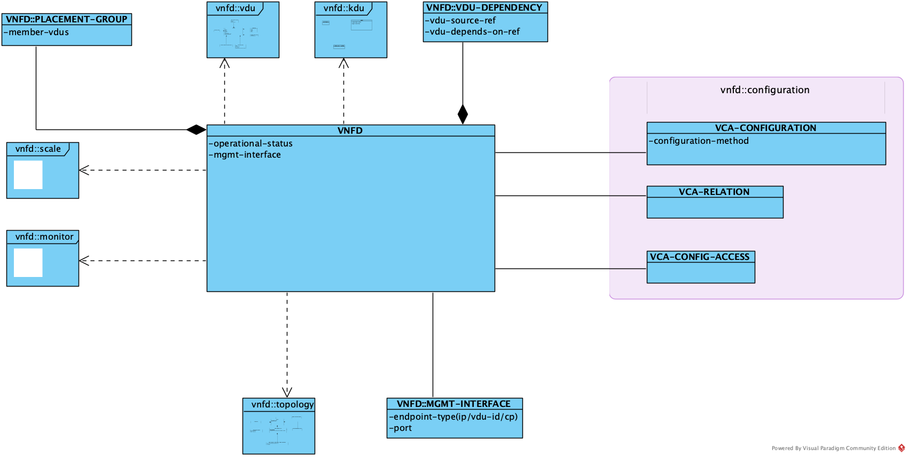
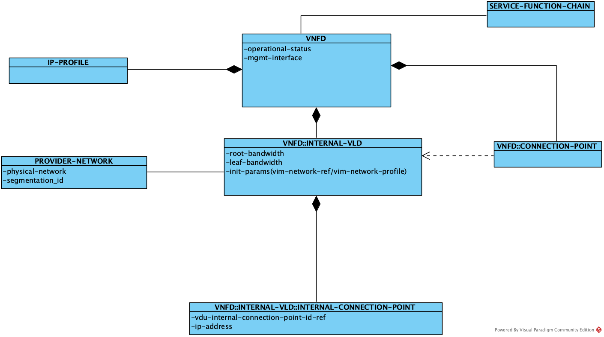
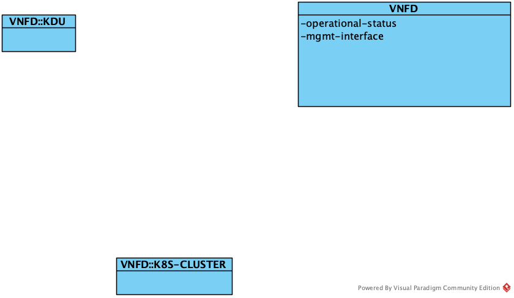

# VNFD(Virtual Network Function Descriptor)

VNFD描述了网络服务内部VNF的属性和拓扑。

VNFD主要属性如下图所示：

## configuration

定义了VNF的配置属性和配置方法。包括：vca-configuration, vca-relation和vca-config-access。

其中，vca-configuration和vca-relation定义了vnf的配置动作参数以及vnf内部组件之间的依赖关系，它们的详细定义可以参考[NSD的配置部分](NSD.md#configuration)，vca-config-access定义了vnf实例的访问方式。

## topology

VNFD内部可能包含了多个VDU，它们之间也存在着拓扑连接关系。

## vdu

vdu实例对应到虚拟机实例。它包括以下属性：

## kdu

## monitor

## scale

